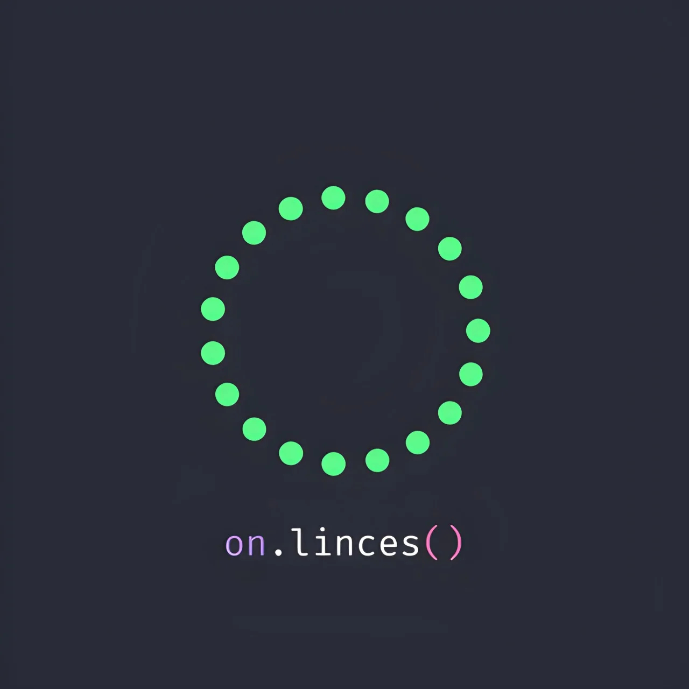

# Community Hub — OnLinces

**Plataforma web del club estudiantil de programación del TecNM en Celaya.**

---

## 📖 Descripción

**Community Hub** es la aplicación web del club **OnLinces**. Centraliza la vida del club: la información de los miembros y sus roles, la galería de eventos, los proyectos activos (Hack OnLinces, Script Estudiantil, Advent of Code) y las preferencias personales de cada usuario.

El proyecto está construido con un fuerte enfoque en la **experiencia visual** y la **accesibilidad temática**: temas claro/oscuro, estilos redondeados o planos, y efectos activables/desactivables, todo persistido en el navegador y aplicable en tiempo real.

> 🚧 **Estado:** frontend completo y funcional con datos simulados. Las integraciones con backend están preparadas y marcadas con comentarios `BACKEND:` a lo largo del código.

---

## ✨ Características

### 🎨 Sistema de temas configurable
- **Tema claro / oscuro** con fondos e imágenes propios.
- **Estilo redondeado / plano** que alterna entre *glassmorphism* y superficies sólidas.
- **Efectos on / off** que desactiva transiciones, sombras y transformaciones.
- Los tres ejes son **independientes** y se persisten en `localStorage`.
- Todas las vistas y componentes consumen **variables CSS globales**, por lo que cualquier combinación de tema se aplica al instante.

### 👥 Miembros con árbol jerárquico
- Estructura organizacional **construida automáticamente** a partir de un array plano de miembros.
- Layout calculado en tiempo real (algoritmo tipo *Reingold–Tilford* simplificado) con conexiones SVG.
- Soporte para **miembros multi-área** (una persona puede pertenecer a varias ramas).
- Presidente y Vicepresidente se muestran como cabecera; los líderes y sus equipos forman el árbol.
- Integración lista para backend en `src/composables/useMembers.ts`.

### 🖼️ Galería
- Grid responsivo con tarjetas, overlay con título y **lightbox** a pantalla completa.
- Navegación con teclado (`Esc`, `←`, `→`) y bloqueo de scroll del body.
- Paginación integrada con el formato de respuesta del backend.
- Punto de integración claro en `src/composables/useGallery.ts`.

### 🚀 Proyectos
- Carrusel horizontal con tarjetas de proyecto.
- **Modal** con descripción completa y enlace externo al sitio.
- Fuente única de datos en `src/data/projects.ts`, fácil de extender.

### 🔐 Autenticación
- Modal global con pestañas de **Iniciar sesión** y **Registrarse**.
- Modo demo: cualquier correo/contraseña funciona.
- Persistencia en `localStorage` mientras no exista backend.
- Protección de la vista de Perfil: botón deshabilitado sin sesión + guard en el router.
- Listo para conectar con SSO/API en `src/composables/useAuth.ts`.

---

## 🛠️ Stack

| Capa | Tecnología |
|------|-----------|
| Framework | Vue 3 (`<script setup>` + Composition API) |
| Build tool | Vite |
| Lenguaje | TypeScript |
| Ruteo | Vue Router |
| Estilos | CSS puro con variables y *scoped styles* |
| Estado global | Composables (`useTheme`, `useAuth`, `useMembers`, `useGallery`) |
| Iconografía | SVG inline (sin dependencias externas) |
| Persistencia local | `localStorage` |